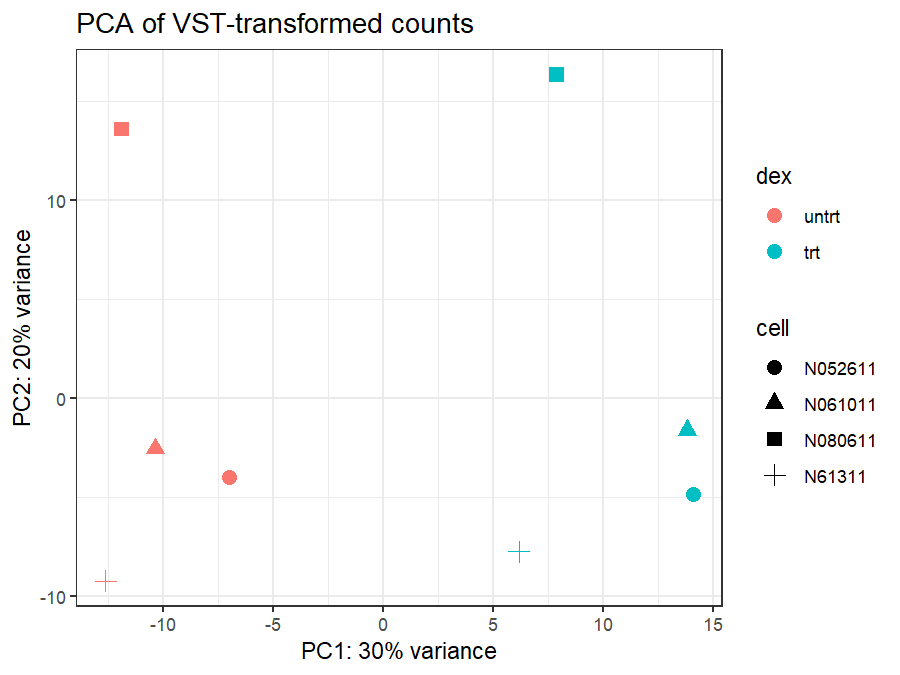
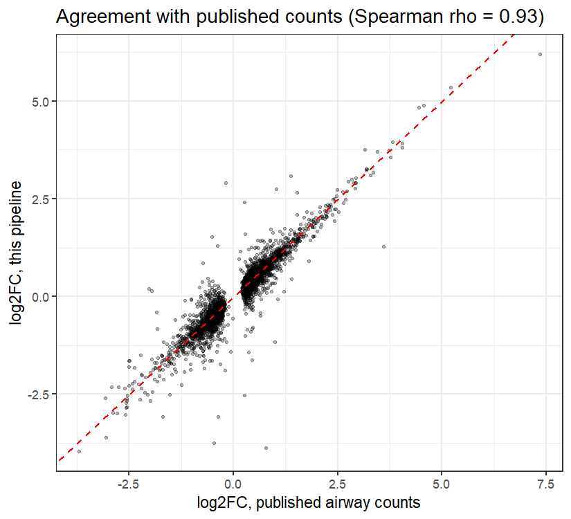

# Bulk RNA-seq from raw reads: airway smooth muscle cells + dexamethasone

A reproducible, end-to-end bulk RNA-seq pipeline that goes from raw sequencing reads in SRA to differential expression, and checks its own output against the published count table for the same study.

**Pipeline:** SRA → FastQC → fastp → Salmon → MultiQC → tximport → DESeq2

## Dataset

Public data from GEO [GSE52778](https://www.ncbi.nlm.nih.gov/geo/query/acc.cgi?acc=GSE52778) (Himes et al., *PLoS One* 2014): primary human airway smooth muscle cells from four donors, each cultured untreated and with dexamethasone (a glucocorticoid). This gives 8 paired-end samples in a paired design. The eight runs used here are the ones in the Bioconductor `airway` package; see [`samples.tsv`](samples.tsv).

## Pipeline

| Step | Script | Tools | Output |
|---|---|---|---|
| 1. Download | `scripts/01_download.sh` | sra-tools (`fastq-dump`) | First 2M read pairs per run |
| 2. QC and trimming | `scripts/02_qc_trim.sh` | FastQC, fastp, MultiQC | Trimmed reads, QC reports |
| 3. Reference index | `scripts/03_salmon_index.sh` | Salmon | Index on GENCODE v50 protein-coding transcripts, transcript-to-gene table |
| 4. Quantification | `scripts/04_salmon_quant.sh` | Salmon, MultiQC | Transcript-level estimates (`quant.sf`) |
| 5. Differential expression | `scripts/05_deseq2.R` | tximport, DESeq2, apeglm | Results table, figures, validation |

Steps 1–4 ran in a Linux environment (GitHub Codespaces, 2 cores, 8 GB RAM) set up with conda/mamba; see [`environment.yml`](environment.yml). Step 5 ran in R 4.4. Exact package versions are in [`results/deseq2/sessionInfo.txt`](results/deseq2/sessionInfo.txt).

## Design choices

- **Read subset.** Each run was limited to its first 2 million read pairs (`fastq-dump -X`) to fit the compute environment. This is a subset rather than a random subsample, and it reduces statistical power compared with the full data (see Validation).
- **Protein-coding reference.** Salmon indexed GENCODE v50 protein-coding transcripts only (382,428 transcripts, 23,879 genes), because a full-transcriptome index was at risk of exceeding 8 GB RAM without swap. Salmon collapsed identical sequences, leaving 376,182 indexed transcripts. Reads from lncRNAs and other non-coding genes are therefore not quantified.
- **Quantification.** Salmon ran with automatic library-type detection (`-l A`) and GC-bias correction (`--gcBias`).
- **Gene-level summary.** tximport summarised transcripts to genes using a transcript-to-gene table built from the GENCODE FASTA headers.
- **Filtering.** Genes were kept if they had at least 10 counts in at least 4 samples (the size of the smallest group).
- **Paired model.** The DESeq2 design is `~ cell + dex`, which accounts for differences between donors and tests the dexamethasone effect within each donor.
- **Fold-change shrinkage.** apeglm shrinkage was applied for ranking and plotting. Significance used Benjamini–Hochberg adjusted p < 0.05.

## Quality control

All 8 samples were consistent, with no outliers. The full MultiQC report is in [`results/multiqc/multiqc_report.html`](results/multiqc/multiqc_report.html); download it to view, since GitHub doesn't render HTML.

| Metric | Range across samples |
|---|---|
| Reads passing fastp filters | 95.9–98.1% |
| Reads with adapter trimmed | 0.3–0.4% |
| GC content | 48–50% |
| Salmon mapping rate | 93.4–94.7% |
| Detected library type | `IU` (inward, unstranded) in all 8 |

Duplication was about 2% by fastp (read pairs) and 23–27% by FastQC (single reads per file). That gap is expected in RNA-seq: highly expressed transcripts produce many identical single reads. For that reason reads were not deduplicated.

## Results

**PCA.** Treatment separates the samples along PC1 (30% of variance), with all untreated samples on one side and all treated samples on the other. Donor accounts for much of PC2 (20%): each donor's two samples sit at a similar PC2 position. This supports modelling donor explicitly.



**Known glucocorticoid-responsive genes.** All seven are strongly upregulated with dexamethasone:

| Gene | log2FC (shrunken) | Adjusted p |
|---|---|---|
| ZBTB16 | 6.09 | 1.4e-24 |
| KLF15 | 4.70 | 3.2e-15 |
| FKBP5 | 3.77 | 5.8e-45 |
| TSC22D3 | 3.20 | 3.5e-23 |
| PER1 | 3.12 | 1.1e-13 |
| DUSP1 | 2.87 | 4.2e-42 |
| CRISPLD2 | 2.64 | 2.0e-34 |

The full results table is in [`results/deseq2/dex_vs_untrt_results.csv`](results/deseq2/dex_vs_untrt_results.csv). The MA plot and top-30 heatmap are in [`results/deseq2/`](results/deseq2/).

## Validation against the published counts

`05_deseq2.R` runs the same DESeq2 model on the authors' count table (the Bioconductor `airway` package: full sequencing depth, GRCh37 / Ensembl 75) and compares the two sets of results over the 10,386 genes present in both.

| | This pipeline | Published counts |
|---|---|---|
| Genes significant (adjusted p < 0.05) | 912 | 3,217 |
| Overlap | 890 | |

- **97.6%** of the genes this pipeline calls significant are also significant in the published data.
- The **Spearman correlation of log2 fold changes is 0.93** for genes significant in either analysis.

The smaller number of significant genes is expected, because the subset is much shallower than the full data. The strongest effects replicate, while smaller effects need more reads to reach significance. Other differences between the two analyses are the annotation (GENCODE v50 protein-coding vs Ensembl 75), the reference build, and the quantification method.



## Limitations

- The analysis uses a read subset, so it has less power than the full dataset.
- Non-coding genes are not quantified.
- `03_salmon_index.sh` downloads the *latest* GENCODE release and records the version it used in `data/ref/GENCODE_VERSION.txt`. v50 was used here. To reproduce these exact numbers later, pin the URL to v50.

## Reproducing

Steps 1–4 need Linux or macOS. Step 5 runs in any R installation.

```bash
mamba env create -f environment.yml
conda activate rnaseq
./scripts/01_download.sh
./scripts/02_qc_trim.sh
./scripts/03_salmon_index.sh
./scripts/04_salmon_quant.sh
```

```r
BiocManager::install(c("DESeq2", "tximport", "apeglm", "pheatmap", "airway"))
source("scripts/05_deseq2.R")   # run from the repository root
```

Raw reads, trimmed reads and the Salmon index are not committed (see `.gitignore`); the scripts regenerate them.

## Repository layout

```
├── samples.tsv            # run IDs, donor cell line, treatment
├── environment.yml        # command-line tool versions
├── scripts/               # 01–05, in run order
└── results/
    ├── multiqc/           # combined QC report
    └── deseq2/            # results table, figures, validation, sessionInfo
```

## Reference

Himes BE, Jiang X, Wagner P, et al. RNA-Seq transcriptome profiling identifies CRISPLD2 as a glucocorticoid responsive gene that modulates cytokine function in airway smooth muscle cells. *PLoS One*. 2014;9(6):e99625.

---
Abraham Dayalu · [github.com/avramdayalu](https://github.com/avramdayalu)
